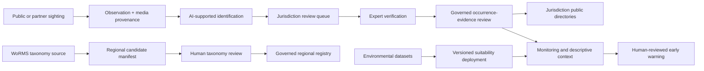

# Buildathon architecture

The arrows describe controlled handoffs, not automatic scientific promotion. Authentication and jurisdiction grants constrain private operational evidence. Platform-admin workflows govern sources and scientific state. Public endpoints expose only approved projections and safe attribution.

